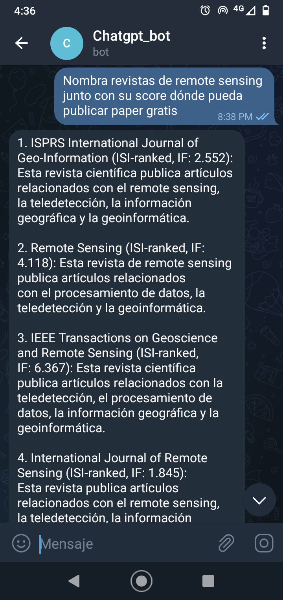
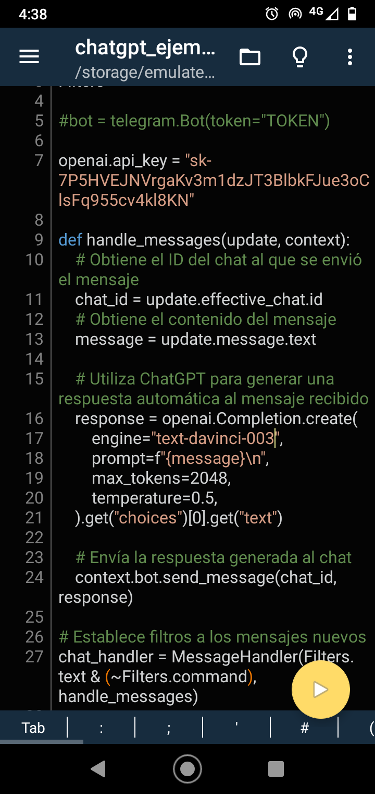

# gpt3-python-telegram
Chatbot con Python y Gpt-3 de OpenAI desplegado en Telegram

para este proyecto necesitarás seguir los siguientes pasos:

Asegúrate de tener la última versión de Telegram instalada en tu dispositivo.

Abre la aplicación de Telegram y busca a @BotFather en el buscador de usuarios.

Haz clic en el nombre de @BotFather y envía un mensaje de texto diciendo "start".

@BotFather te enviará una lista de comandos que puedes usar para controlar a tu bot. Para crear un nuevo bot, envía un mensaje de texto diciendo "createbot".

@BotFather te preguntará por el nombre de tu bot y por un nombre de usuario para tu bot. El nombre de usuario debe terminar en "bot", por ejemplo "chatgpt_bot".

@BotFather te proporcionará un token de acceso único para tu bot. Guarda este token, ya que lo necesitarás más adelante.

si deseas más detalles de como crear el chatbot y como acceder al token puedes acceder a estos dos enlaces:

Crear un bot en Telegram: https://core.telegram.org/bots#3-how-do-i-create-a-bot

Obtener un token de acceso para tu bot: https://core.telegram.org/bots#6-botfather

Ahora instala las siguientes librerias para utilizar el script de python: "pip install openai" y "pip install python-telegram-bot --upgrade"

dentro de "chatbot_telegram.py" inserta el token de openai y el de telegram.

Es posible hacer este proceso también en un teléfono Android. Los pasos que debes seguir son los mismos que mencioné anteriormente, solo necesitarás una aplicación de escritorio de Python en tu teléfono Android para poder crear y ejecutar scripts de Python.

Aquí hay algunas opciones de aplicaciones de escritorio de Python para Android que puedes considerar:

QPython: una aplicación gratuita que incluye un intérprete de Python y un editor de código.

PyDroid 3: una aplicación de pago que incluye un intérprete de Python, un editor de código y una consola.

PyCharm: una aplicación de pago que incluye un intérprete de Python, un editor de código y una consola, así como varias otras características para el desarrollo de aplicaciones.

En mi caso utilice pydroid 3, aqui unos screenshot

